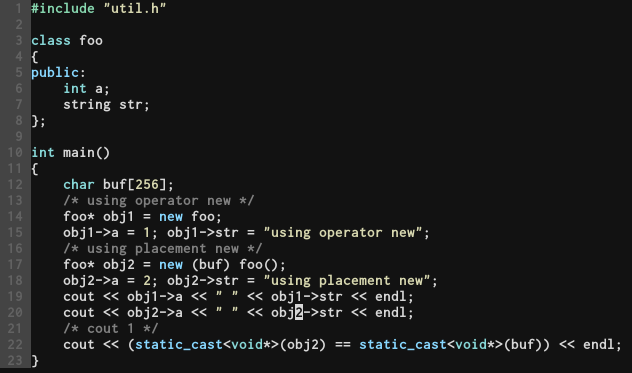

- - -

#### Linux虚拟地址空间布局

虚拟地址空间分为两块区域：其中地址较高的块区域为内核进程地址区域，所有的虚拟地址进程中的内核进程地址区域映射的物理地址是一样的；较低地址的一块区域是用户进程虚拟地址区域，不同的进程通过页表映射的物理地址是不一样的。

用户进程地址空间分为以下几类空间：内核空间，栈，内存映射段，堆，BSS段，数据段和保留段。
- 内核空间： 总是映射到相同的物理页面，用户进程无法读取其中的数据，如果需要使用其中的系统调用，可以使用中断进行用户态到内核态的切换。
- 栈：主要供线程、函数调用维护、非静态局部变量和临时栈上内存使用（如使用alloca函数可以获取当前栈帧中的内存）。栈的增长方向是从高地址到低地址。
- 内存映射段：位于栈和堆之间，可以用于共享内存进行进程之间通信，也可以在这里映射动态库。
- 堆：用于程序动态分配内存，增长方向是从低地址到高地址。
- BSS段：
    - 未初始化的全局变量和静态局部变量（包含存在与函数中的静态局部变量）
    - 初始值为0的全局变量和静态局部变量(包含存在与函数中的静态局部变量，gcc中测试是这种情况，依赖于编译器实现)
使用objdump可以查看不同段的信息，例如查看bss段的信息：`objdump -j .bss -S test_bss.o`
BSS段中在可执行文件中不会为变量预先分配空间，只会记录变量在导入内存时需要的空间大小。
- DATA段： 初始化（初始值不为零）的全局变量和静态局部变量。
- Text: 存放代码的地方，里面可能会存放字符串常量。

#### 自由存储区和堆的区别

网上常见的**关于new和malloc的区别**一般会提到new是从自由存储区获取内存，而malloc是从堆中获取内存，但是没有说自由存储区和堆的区别。在网上可以搜到C++之父 Dr. Bjarne Stroustrup关于这个问题的回复。

> http://zamanbakshifirst.blogspot.com/search/label/heap

总结下大意，C\++标准中没有明确的规定自由存储区中的内存是从哪儿来的，这说明自由存储区中的内存甚至可以使用栈上空间，到底使用哪里的空间得根据底层的new操作符实现来推断。上述链接中也说了，free store和heap是在不同语境下使用的，heap一般指的是操作系统中的堆空间，参考上面的的进程虚拟地址空间分布，而free store一般是对于C\++这种高级语言而言的。（其实，一般情况下（可以参考STL的内存分配器实现，里面还是得调用malloc在对空间分配内存），free store中的内存也是从堆空间获得。只是对于free store和heap的使用方式是不一样的。说到heap和free store的使用方式不一样就得说到new操作符的工作原理。

new 操作符的实际步骤包括两步：
- 获取对象需要的内存
- 在所获得的内存上调用对象的构造函数，并返回对象指针

对于第一步有两种实现方式，一种是使用 `void* operator new(std::size_t size)` 来分配内存（在clang中是使用malloc分配内存），另一种是operator new的重载形式`void* operator new(std::size_t, void* p)`, 称为**placement   new* ***, clang里的实现是直接将输入的指针返回，使用场景是先预先获得一块内存的地址，然后将此内存地址传入`placement new`，调用对象构造函数在`placement new`返回的内存地址上构造对象。并将对象地址返回。

从上面的描述可以看出new操作符不管第一步中获得的地址的来源是什么，只要内存地址是有效的则可以在其上调用对象构造函数构造对象。可以试着在栈上空间中构造对象。

从程序的注释中可以印证我们之前的描述。

现在回到使用free store和heap的差异，当使用free store时，使用new操作符不需要管从哪儿获取的内存，该操作符会将一个完整的对象构造完成后返回，而使用heap时调用malloc则相当于只完成new操作符的前一半功能，即获得构造对象时需要的内存的地址，后面还需要在所获得的内存上调用构造函数来进行初始化对象。

相比于malloc再调用构造函数，使用new操作符还有额外的好处吗？
1. 优化小内存的分配和释放。如上所说，new获取的内存是从free store中获取，而malloc是直接从堆中获取内存。在实际运作中是否使用malloc等库函数是依赖于实现的，另外由于new是一个比较高级抽象的操作符，因此对于经常分配释放较小的内存的程序，所获得的较小内存可能是从内存池（其实就是维护了一个连接预先从系统中分配的不同大小内存块的链表，参考STL中的内存池的实现）中获取，这样就可以避免频繁的直接从系统中获取内存，这一点malloc就没法提供。
2. 在使用时能够做类型检查，malloc直接返回通用指针然后进行类型转换，而new返回所要分配所要类型的指针，且要求返回的指针与赋值运算符左边变量类型相同，当然不相同也也可以做类型转换。
3. 编译器根据类型自动计算所要分配的字节数。
4. new出现错误会抛出异常，而malloc只会返回NULL。
5. 使用new/delete, 会自动调用对象的构造函数或者析构函数。
