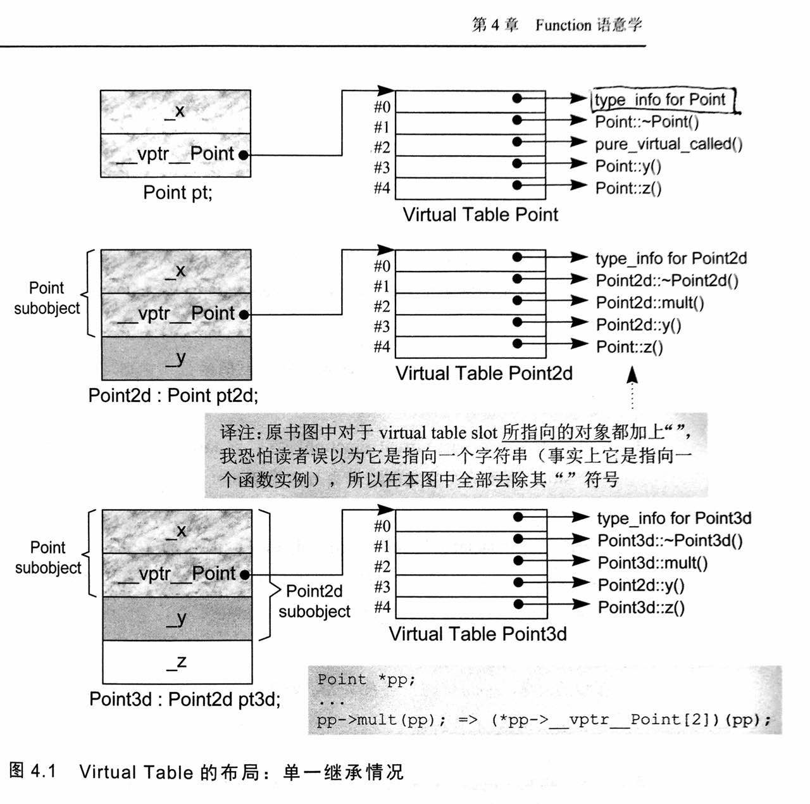
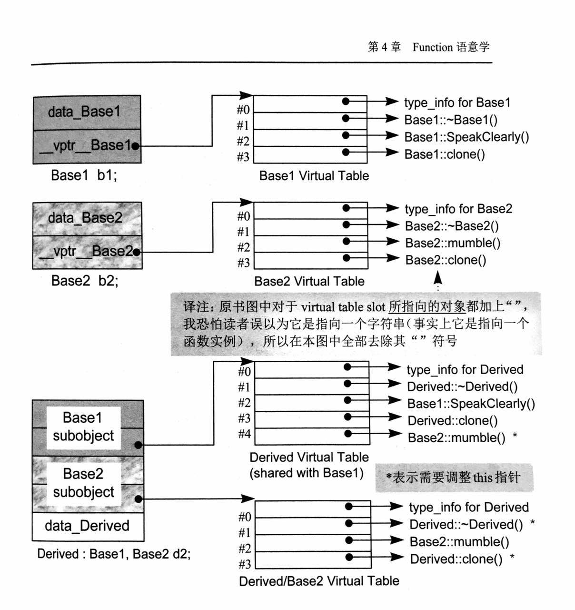

> 深入探索C++对象模型 -- Function 语意学

<!-- more -->

#### Member 的各种调用方式
__Nostatic Member Functions__
C++的设计准则之一就是使得非静态成员函数的调用与使用非成员函数的效率相同。怎么实现的呢？
- 将调用该函数的对象的this指针作为函数的第一个参数，则里面使用到的对象的成员可以通过该指针来访问
- 使用name mangling方式使得新的函数的名字独一无二
- 将所有调用该函数的地方使用name mangling后的名字
经过上面步骤后，非静态成员函数和非成员函数没有多大区别。

__Virtual Member FUnctions__
使用ptr调用虚拟函数时则会通过虚拟表来查找对应类的虚拟函数，即通过虚拟机制实现，这个步骤一般在执行期进行。而使用对象调用虚拟函数，则只会调用该对象的对应的类中的虚拟函数，这个步骤一般在编译阶段就可以决议。

__Static Member Functions__
通过对象或者对象的指针来调用静态成员函数，都会被编译器转化为一般的非成员函数的调用。
静态函数的主要特征是没有this指针，因此它具有如下特性：
- 不能直接存取class中的非静态成员
- 不能够被声明为const、virtual和volatile
- 不必经由对象或者对象指针调用

静态函数的应用，比如作为线程函数。

#### Virtual Member Functions (虚拟成员函数)

__单一继承的情况__
在编译期设定 virtual function 所需要的信息是：
- 经过对象指针ptr可以获取到该对象的virtual table。
- 尽管无法知道所调用的函数具体是哪个函数实例，但是可以知道要调用的函数实例的地址在virtual table中的哪个slot中

从以下的图中可以看出不管继承的层数是多少层，virtual table相对于对象起始位置的偏移都一样，这也许就是可以通过对象指针ptr获得virtual table的原因。


__多重继承的情况__

为了解决多重继承时需要适当的调整this指针使得this能够指向正确的derived object起始地址或者subobject的起始地址。具体的实现技术是使用Thunk技术。这里所谓的thunk就是一小段的assembly代码，主要实现两个功能：1）以适当的offset调整this指针，2）跳到virtual function。具体到virtual table中，就是每个slot中装载的有可能就是一个虚拟函数地址，也有可能是指向一个thunk。

关于thunk的效率: thunk只有以assembly代码完成才有效率。现代的编译器真的能够有效的编译thunk吗？还是尽量避免这种多重继承吧。

但是由于存在多个基类，那么可能同一个虚拟函数需要不同的slot内容，比如下面的情况。
```
/* 类Derived  继承两个基类 Base1 和 Base2 */
Base1 *pbase1 = new Derived;
Base2 *pbase2 = new Derived;
/* 不需要调整this指针，因为Base1和Derived的起始位置是一样的， 因此在vtbl中slot中直接存放derived的析构函数 */
delete pbase1;
/* 需要将pbase2向后调整到Derived的对象的起始地址，然后再调用Derived的析构函数，因此在vtbl中的相应slot应该指向实现这个功能的thunk */
delete pbase2;
```

为了解决同一个虚拟函数可能被直接调用和使用thunk调用这两种情况，需要为每一个基类配置一个相应的virtual table，但是第一个base的起始地址和Derived的相同，因此第一个Base所占的subobject可以与Derived object共用一个virtual table。因此在单一继承的情况下，只需一个virtual table就够了。一般如果继承n个base时，则需要额外的n-1个virtual table。



__虚拟继承下的Virtual Functions__
在虚拟继承的情况下，与多重继承一样仍然需要使用thunk技术来修改this指针，然后调用虚拟函数。

#### 指向Member Function的指针
对非静态成员函数进行取地址操作，获得的是它在内存中的地址。但是这个地址是不完全的，需要绑定在某个对象中执行。
```
// 一个指向非静态成员函数的指针的声明
double (Point::* pmf)();
// 定义和初始化
double (Point::* coord)() = &Point::x;
// 调用
(ptr->*coord)();
```

值得注意的是对virtual function进行取地址操作得到的是这个虚拟函数在virtual table中的索引值。

#### Inline Functions

如果参数带有副作用，比如传入的参数是一个函数调用返回的结果，为了保证此函数不被多次调用，则会使用临时变量保存结果。当inline functions被以一个单一的表达式进行多重调用时（这是因为展开时，为了防止局部变量与调用处的变量名字冲突，需要为每次调用产生一个独一无二的局部变量名字），以及在inline函数中存在多个局部变量时，当inline函数展开时，也会产生临时变量。

从上面的叙述可以看到，内联与宏的展开不一样，因为内联展开时会使用临时变量来避免名称冲突，而宏则是直接进行替换，可能会造成名称冲突。

另外，使用inline关键字并不表示函数一定会被展开，这个得由编译器判断此函数是否符合内联的条件。

什么时候应该使用内联函数：对程序性能有要求时，或者想用宏来定义一个函数时，另外在类中定义的函数相当于加上了inline关键字。
